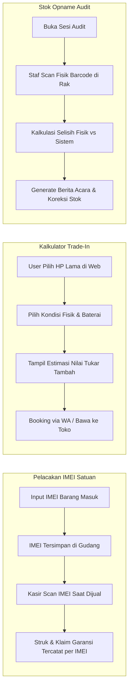

# Product Requirement Document (PRD): Fitur Lanjutan — Pelacakan IMEI, Kalkulator Trade-In & Stok Opname

**Nama Proyek:** Modul Ekstensi Lanjutan (Advanced Gadget Warehouse Suite)  
**Aplikasi Induk:** Sistem Manajemen Inventaris Gudang Gadget  
**Status:** Approved / Proposed  
**Versi:** 1.0  
**Tanggal:** 27 September 2026  

---

## 1. Ringkasan Eksekutif (Executive Summary)

### 1.1 Latar Belakang
Untuk mentransformasi sistem inventaris gudang menjadi platform kelas enterprise setara distributor resmi gadget, diperlukan 3 pilar fungsional lanjutan:
1. **Pelacakan Satuan IMEI / Serial Number:** Menjamin setiap unit fisik dapat dilacak riwayatnya secara individual (mencegah penipuan klaim garansi & retur).
2. **Kalkulator Estimasi Tukar Tambah (*Trade-In Engine*):** Memfasilitasi calon pembeli di web publik untuk menghitung nilai tukar tambah gadget lama ke unit baru.
3. **Modul Stok Opname & Rekonsiliasi Audit:** Memudahkan audit stok fisik vs data sistem secara cepat menggunakan barcode scanner untuk mencegah kebocoran/kehilangan barang.

---

## 2. Rincian Modul & Kebutuhan Fungsional



---

## 3. Modul 1: Pelacakan Satuan IMEI & Serial Number (IMEI Tracking)

### FR-1.1: Pencatatan IMEI saat Barang Masuk (Purchase / Intake)
- Saat menginput stok masuk, staf dapat memasukkan daftar nomor IMEI/Serial (bisa input manual, scan barcode IMEI dus, atau paste daftar nomor IMEI sekaligus per baris).
- Setiap record IMEI memiliki status siklus hidup (*lifecycle*):
  - `available` (Tersedia di Gudang)
  - `sold` (Terjual ke Pelanggan)
  - `in_service` (Sedang dalam proses perbaikan teknisi)
  - `defective` (Barang cacat pabrik / siap retur supplier)
  - `returned` (Dikembalikan oleh pembeli)

### FR-1.2: Pemilihan & Scan IMEI di Modul Kasir (POS)
- Saat produk gadget ditambahkan ke keranjang belanja POS, kasir memindai (*scan barcode*) atau memilih nomor IMEI unit yang fisik barangnya diserahkan ke pembeli.
- Nomor IMEI tercetak resmi pada **Struk Belanja Thermal** dan **Invoice PDF**.

### FR-1.3: Verifikasi Garansi & Riwayat Unit (IMEI Lifecycle Audit)
- Admin/Kasir dapat mencari nomor IMEI tertentu untuk melihat riwayat lengkap:
  * Kapan barang masuk & dari supplier mana.
  * Kapan barang terjual, nomor nota penjualan, dan identitas pembeli.
  * Sisa masa berlaku garansi toko/resmi.
  * Riwayat servis yang pernah dilakukan pada unit tersebut.

---

## 4. Modul 2: Kalkulator Estimasi Tukar Tambah (Trade-In / Buyback Engine)

### FR-2.1: Halaman Publik Trade-In (`/shop/tukar-tambah`)
- Form interaktif 3 langkah (*step-by-step wizard*):
  1. **Pilih Perangkat:** Pilih Brand (Apple, Samsung, dll) ➔ Model (misal: *iPhone 11*) ➔ Kapasitas (misal: *128GB*).
  2. **Penilaian Kondisi (Grading):**
     - *Grade A (Sempurna):* Mulus 99%, TrueTone/FaceID aktif, Battery Health > 85%, Layar & Bodi tanpa lecet.
     - *Grade B (Normal Pemakaian):* Lecet halus/bintik jamur tipis, fungsi 100% normal.
     - *Grade C (Minus Ringan):* Ada dent/lecet terlihat, BH < 80%, atau box hilang.
     - *Grade D (Minus Fungsi):* Layar retak/shadow, kamera getar, atau bypass.
  3. **Hasil Estimasi & Rekomendasi Unit Baru:**
     - Menampilkan **Estimasi Nilai HP Lama Anda: Rp 3.800.000**.
     - Pilihan gadget baru yang ingin dibeli dengan kalkulasi sisa dana yang perlu ditambah (*Nominal Tambah Bayar*).
     - Tombol **"Ajukan Tukar Tambah via WhatsApp"** atau booking jadwal kunjungan toko.

### FR-2.2: Master Matrix Harga Trade-In di Admin Dashboard
- Admin dapat mengatur formula dasar harga beli bekas:
  $$\text{Harga Grade A} = \text{Harga Patokan Master}$$
  $$\text{Harga Grade B} = \text{Grade A} - 5\%$$
  $$\text{Harga Grade C} = \text{Grade A} - 15\%$$
- Admin dapat mengupdate harga patokan (*Buyback Price List*) secara berkala.

### FR-2.3: Integrasi Transaksi Trade-In di Kasir (POS)
- Kasir dapat memilih opsi pembayaran **"Tukar Tambah Unit"**.
- Nilai taksiran HP bekas pelanggan langsung memotong total tagihan pembelian HP baru di kasir.
- HP bekas yang diterima otomatis masuk ke sistem gudang sebagai barang masuk `second/used` dengan status siap dicek teknisi.

---

## 5. Modul 3: Stok Opname & Audit Inventaris (Stock Opname Engine)

### FR-3.1: Inisiasi Sesi Stok Opname (*Audit Session*)
- Admin/Kepala Gudang membuka sesi audit (Pilihan: *Seluruh Gudang*, atau per *Kategori*, misal: Hanya kategori iPhone).
- Sistem mencatat snapshot jumlah stok pada saat sesi dimulai (*System Stock Snapshot*).

### FR-3.2: Mode Cepat Scan Barcode / IMEI Fisik
- Petugas audit berkeliling rak gudang menggunakan *Barcode Scanner nirkabel* atau kamera smartphone.
- Setiap kali barcode/IMEI discan, counter hitungan fisik (*Actual Count*) otomatis bertambah (+1) disertai bunyi bip konfirmasi.

### FR-3.3: Laporan Rekonsiliasi & Penyesuaian Stok Otomatis
- Sistem menghitung selisih secara otomatis:
  $$\text{Selisih} = \text{Stok Fisik Aktual} - \text{Stok Sistem}$$
- Menampilkan rincian:
  - 🟢 **Sesuai (Match):** Jumlah fisik sama persis dengan sistem.
  - 🔴 **Selisih Kurang (Shortage):** Barang hilang atau belum tercatat keluar.
  - 🟡 **Selisih Lebih (Surplus):** Barang ada di rak tetapi belum terinput di sistem.
- Tombol **"Koreksi & Finalisasi Stok"** yang otomatis mengupdate angka stok gudang dengan berita acara audit log: `Penyesuaian Stok Opname Sesi #OPN-xxx`.

---

## 6. Desain Skema Database (Database Schema)

### 6.1 Tabel `gadget_imeis` (Data Satuan IMEI / Serial)
```sql
CREATE TABLE gadget_imeis (
    id BIGINT AUTO_INCREMENT PRIMARY KEY,
    gadget_id BIGINT NOT NULL,
    imei_number VARCHAR(50) UNIQUE NOT NULL,
    serial_number VARCHAR(50) NULL,
    color VARCHAR(50) NULL,
    status ENUM('available', 'sold', 'in_service', 'defective', 'returned') DEFAULT 'available',
    sales_transaction_id BIGINT NULL,  -- FK transaksi saat terjual
    sold_at TIMESTAMP NULL,
    warranty_expired_at DATE NULL,
    notes TEXT NULL,
    created_at TIMESTAMP NULL,
    updated_at TIMESTAMP NULL,
    FOREIGN KEY (gadget_id) REFERENCES gadgets(id) ON DELETE CASCADE,
    FOREIGN KEY (sales_transaction_id) REFERENCES sales_transactions(id) ON DELETE SET NULL
);
```

### 6.2 Tabel `trade_in_masters` (Matrix Patokan Harga Tukar Tambah)
```sql
CREATE TABLE trade_in_masters (
    id BIGINT AUTO_INCREMENT PRIMARY KEY,
    brand VARCHAR(50) NOT NULL,
    model_name VARCHAR(100) NOT NULL,     -- Contoh: iPhone 11 128GB
    base_price_grade_a DECIMAL(15,2) NOT NULL,
    price_grade_b DECIMAL(15,2) NOT NULL,
    price_grade_c DECIMAL(15,2) NOT NULL,
    price_grade_d DECIMAL(15,2) NOT NULL,
    is_active BOOLEAN DEFAULT TRUE,
    created_at TIMESTAMP NULL,
    updated_at TIMESTAMP NULL
);
```

### 6.3 Tabel `stock_opnames` & `stock_opname_items` (Audit Stok)
```sql
CREATE TABLE stock_opnames (
    id BIGINT AUTO_INCREMENT PRIMARY KEY,
    opname_number VARCHAR(50) UNIQUE NOT NULL, -- Contoh: OPN-20260927-0001
    auditor_id BIGINT NOT NULL,                -- User yang melakukan audit
    category_filter VARCHAR(50) NULL,          -- Null jika seluruh gudang
    status ENUM('in_progress', 'completed', 'cancelled') DEFAULT 'in_progress',
    total_system_items INT DEFAULT 0,
    total_physical_items INT DEFAULT 0,
    total_difference INT DEFAULT 0,
    notes TEXT NULL,
    started_at TIMESTAMP NOT NULL,
    completed_at TIMESTAMP NULL,
    created_at TIMESTAMP NULL,
    updated_at TIMESTAMP NULL,
    FOREIGN KEY (auditor_id) REFERENCES users(id)
);

CREATE TABLE stock_opname_items (
    id BIGINT AUTO_INCREMENT PRIMARY KEY,
    stock_opname_id BIGINT NOT NULL,
    gadget_id BIGINT NOT NULL,
    system_stock INT NOT NULL,
    physical_stock INT NOT NULL DEFAULT 0,
    difference INT NOT NULL DEFAULT 0,         -- physical_stock - system_stock
    notes VARCHAR(255) NULL,
    FOREIGN KEY (stock_opname_id) REFERENCES stock_opnames(id) ON DELETE CASCADE,
    FOREIGN KEY (gadget_id) REFERENCES gadgets(id) ON DELETE CASCADE
);
```

---

## 7. Rencana Tahapan Pelaksanaan (Action Plan)

```
[ Tahap 1: Pelacakan IMEI & Serial Number ]
├── Buat tabel gadget_imeis & model relasi dengan Gadget
├── Form input IMEI saat barang masuk & import Excel
└── Integrasi Kasir (POS): Pilih IMEI saat checkout & cetak di struk

[ Tahap 2: Kalkulator Trade-In (Tukar Tambah) ]
├── Master Matrix Harga Beli Bekas di Admin Panel
├── Halaman Publik Kalkulator Tukar Tambah (/shop/tukar-tambah)
└── Fitur Potong Tagihan Trade-In di Kasir POS

[ Tahap 3: Modul Stok Opname & Rekonsiliasi ]
├── Fitur Buka Sesi Stok Opname & Mode Scan Cepat Barcode
├── Layar Rekonsiliasi Real-Time (Cek Selisih Fisik vs Sistem)
└── Tombol Eksekusi Penyesuaian Otomatis & Download Berita Acara Audit
```

---

## 8. Kriteria Keberhasilan (Definition of Done)
1. Setiap unit smartphone yang terjual di kasir tercatat nomor IMEI-nya secara spesifik di database dan struk nota.
2. Calon pembeli online dapat menghitung estimasi nilai tukar tambah HP lama mereka secara transparan dalam waktu kurang dari 30 detik.
3. Transaksi tukar tambah di kasir dapat memotong total tagihan belanja HP baru dan otomatis memasukkan HP bekas ke stok barang second.
4. Petugas gudang dapat melakukan audit stok opname menggunakan barcode scanner dan mendapatkan laporan selisih stok secara instan tanpa perhitungan manual.
