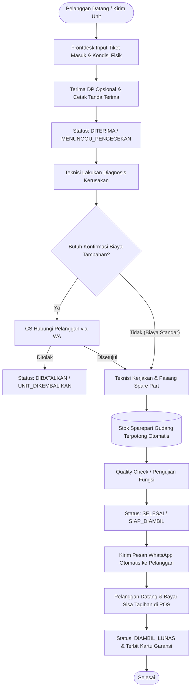

# Product Requirement Document (PRD): Modul Jasa Servis & Reparasi Gadget

**Nama Proyek:** Modul Manajemen Servis & Reparasi Gadget (Gadget Repair & Work Order Management)  
**Aplikasi Induk:** Sistem Manajemen Inventaris Gudang Gadget  
**Status:** Approved / Proposed  
**Versi:** 1.0  
**Tanggal:** 27 September 2026  

---

## 1. Ringkasan Eksekutif (Executive Summary)

### 1.1 Latar Belakang
Selain menjual unit gadget dan melayani pembelian grosir, toko memiliki peluang bisnis besar melalui **Jasa Servis & Reparasi** (seperti penggantian LCD, baterai, perbaikan port charger, kamera, logic board/IC, maupun penanganan software). Modul ini mengintegrasikan alur kerja penerimaan servis, pengerjaan teknisi, pemotongan stok suku cadang (spare part) di gudang secara otomatis, kasir pelunasan, hingga pelacakan status servis online (*Live Tracking*) bagi pelanggan.

### 1.2 Tujuan & Sasaran Bisnis (Objectives)
- **Otomasi Pemotongan Suku Cadang:** Penggunaan suku cadang (misal baterai/LCD) selama proses servis otomatis memotong stok barang di gudang.
- **Transparansi & Kepuasan Pelanggan:** Pelanggan dapat memantau progres perbaikan unit mereka secara mandiri melalui website publik (*Live Tracking*) dan menerima pesan notifikasi WhatsApp saat unit telah selesai diperbaiki.
- **Transparansi Finansial & Komisi Teknisi:** Memisahkan perhitungan laba kotor dari *Biaya Jasa (Labour Fee)* vs *Biaya Suku Cadang (Spare Part)* serta mencatat pembagian komisi teknisi.
- **Garansi Servis Terkelola:** Mencatat masa berlaku garansi servis purna jual untuk mencegah komplain berulang dan mempermudah klaim retur servis.

---

## 2. Pengguna & Hak Akses (User Roles)

| Peran (Role) | Tanggung Jawab Utama | Hak Akses di Modul Servis |
| :--- | :--- | :--- |
| **Frontdesk / Kasir** | Menerima unit servis dari pelanggan, mencatat keluhan, menerima DP, dan menyerahkan unit selesai. | - Buat Tiket Servis Baru & cetak tanda terima<br>- Terima Uang Muka (DP) dan Pelunasan di POS<br>- Kirim notifikasi WhatsApp ke pelanggan |
| **Teknisi (Technician)** | Mendiagnosis kerusakan, memilih spare part gudang yang digunakan, dan mengeksekusi perbaikan. | - Akses Workbench / Dashboard Teknisi<br>- Update status progres pengerjaan<br>- Input spare part yang terpakai (potong stok otomatis)<br>- Input catatan hasil uji fungsi (*Quality Check*) |
| **Pelanggan Publik** | Mengirimkan unit rusak, memantau perbaikan, dan mengambil unit. | - Akses halaman publik *Cek Status Servis* (input No. Tiket / No. HP)<br>- Konsultasi biaya via WhatsApp |
| **Admin / Owner** | Pengawasan operasional, audit spare part, dan laporan pendapatan. | - Akses penuh seluruh tiket servis, setting komisi teknisi, laporan laba servis, dan riwayat klaim garansi. |

---

## 3. Siklus Hidup & Alur Kerja Tiket Servis (Service Lifecycle)



---

## 4. Rincian Kebutuhan Fungsional (Functional Requirements)

### FR-1: Penerimaan Unit & Pembuatan Tiket Servis (Intake Ticket)
- **FR-1.1:** Form input tanda terima servis mencakup data:
  - **Identitas Pelanggan:** Nama lengkap, Nomor WhatsApp, Alamat/Kota.
  - **Identitas Gadget:** Merk & Model (misal: *iPhone 13 Pro 128GB*), Nomor IMEI/Serial Number, Warna unit.
  - **Akses Keamanan:** Pola kunci layar / PIN / Passcode (untuk kebutuhan testing teknisi) atau opsi *Device Direset / Tanpa Sandi*.
  - **Kelengkapan Unit:** Checklist bawaan (Unit Only, Charger, SIM Tray, Dusbook, Casing/Memory Card).
  - **Kondisi Fisik Awal & Minus Bawaan:** Checklist kondisi (Layar retak, Lecet bodi, TrueTone off, Face ID mati, Baterai kembung, Pernah servis di tempat lain).
  - **Keluhan & Permintaan Servis:** Deskripsi masalah dari pelanggan.
  - **Estimasi Biaya & Uang Muka (DP):** Nominal DP yang dibayarkan pelanggan saat masuk.
- **FR-1.2:** Cetak **Surat Tanda Terima Servis (Work Order Slip)** dalam format kertas struk thermal atau A5/A4, memuat nomor nota, barcode/QR kode tiket, dan syarat & ketentuan garansi.

### FR-2: Workbench Teknisi & Integrasi Stok Gudang
- **FR-2.1:** Dashboard khusus teknisi yang menampilkan daftar antrean servis dengan sistem status:
  - `pending` (Baru Diterima)
  - `diagnosing` (Sedang Pengecekan)
  - `waiting_part` (Menunggu Ketersediaan Suku Cadang)
  - `working` (Sedang Dikerjakan)
  - `ready` (Selesai & Siap Diambil)
  - `delivered` (Sudah Diambil Pelanggan / Lunas)
  - `cancelled` (Dibatalkan / Tidak Bisa Diperbaiki)
- **FR-2.2 (Pemakaian Spare Part Otomatis):**
  - Teknisi dapat memilih suku cadang langsung dari database inventaris gudang (misal: *LCD iPhone 13 Pro OLED JK* - Qty: 1).
  - Saat tiket disimpan/diselesaikan, sistem otomatis memotong stok spare part di gudang dengan catatan audit log: `Keluar - Pemakaian Servis No #SRV-xxx`.
- **FR-2.3 (Quality Control Checklist):**
  - Checklist pengujian fungsi pasca servis sebelum unit dinyatakan selesai (Cek Layar Sentuh, Speaker, Kamera Depan/Belakang, Sensor Proximity, Charging, Jaringan Sinyal/WiFi).

### FR-3: Pelunasan Kasir (POS Integration) & Garansi
- **FR-3.1:** Kasir dapat memanggil nomor tiket servis di modul Kasir (POS).
- **FR-3.2 (Kalkulasi Tagihan Otomatis):**
  $$\text{Total Sisa Tagihan} = (\text{Total Biaya Jasa} + \text{Total Harga Spare Part}) - \text{Uang Muka (DP)}$$
- **FR-3.3:** Kasir memproses pelunasan menggunakan multi-metode pembayaran (Tunai, QRIS, Transfer, Debit EDC).
- **FR-3.4:** Cetak **Nota Lunas & Kartu Garansi Servis** yang memuat masa berlaku garansi (misal: Garansi Baterai 90 Hari, Garansi LCD 30 Hari).

### FR-4: Halaman Publik Live Tracking Servis (`/shop/tracking-service`)
- **FR-4.1:** Pengunjung web dapat membuka halaman pelacakan tanpa perlu login akun.
- **FR-4.2:** Form input sederhana: Masukkan **Nomor Tiket Servis** (contoh: `SRV-20260927-001`) atau **Nomor WhatsApp**.
- **FR-4.3:** Tampilan visual *Timeline Stepper* interaktif:
  - 🟢 Unit Diterima Toko (Tanggal & Jam)
  - 🟢 Pengecekan & Diagnosis Kerusakan
  - 🟡 Proses Penggantian Suku Cadang
  - ⚪ Quality Control & Selesai
  - ⚪ Siap Diambil di Toko
- **FR-4.4:** Menampilkan rincian unit yang diservis, estimasi biaya, dan tombol cepat hubungi teknisi via WhatsApp.

### FR-5: Notifikasi WhatsApp Otomatis
- **FR-5.1:** Generator link pesan WhatsApp satu klik untuk:
  - *Kirim Bukti Tanda Terima Masuk ke Pelanggan.*
  - *Konfirmasi Perubahan Biaya / Persetujuan Tindakan Tambahan.*
  - *Pemberitahuan Unit Selesai Diperbaiki & Siap Diambil.*

### FR-6: Manajemen Klaim Garansi & Retur Servis
- **FR-6.1:** Jika pelanggan kembali membawa unit yang sama dalam masa garansi, sistem dapat melacak histori perbaikan sebelumnya berdasarkan No. IMEI atau No. Tiket.
- **FR-6.2:** Buat tiket garansi (*Re-work Ticket*) dengan biaya jasa Rp 0 (Klaim Garansi Toko).

---

## 5. Desain Database & Skema Data (Database Schema)

### 5.1 Tabel `service_tickets` (Tiket Servis Utama)
```sql
CREATE TABLE service_tickets (
    id BIGINT AUTO_INCREMENT PRIMARY KEY,
    ticket_number VARCHAR(50) UNIQUE NOT NULL, -- Contoh: SRV-20260927-0001
    customer_name VARCHAR(100) NOT NULL,
    customer_phone VARCHAR(30) NOT NULL,
    customer_address TEXT NULL,
    device_brand VARCHAR(50) NOT NULL,        -- Apple, Samsung, Xiaomi, dll
    device_model VARCHAR(100) NOT NULL,       -- iPhone 13 Pro 128GB Sierra Blue
    imei_or_serial VARCHAR(100) NULL,
    passcode VARCHAR(50) NULL,                -- Pola / PIN keamanan
    completeness TEXT NULL,                   -- Unit, SIM Tray, Case, Dus
    initial_condition TEXT NULL,              -- Kondisi lecet/minus awal
    problem_description TEXT NOT NULL,        -- Keluhan pelanggan
    technician_notes TEXT NULL,               -- Catatan analisa teknisi
    technician_id BIGINT NULL,                -- FK ke users.id (teknisi)
    cashier_id BIGINT NOT NULL,               -- FK ke users.id (frontdesk penerima)
    status ENUM('pending', 'diagnosing', 'waiting_part', 'working', 'ready', 'delivered', 'cancelled') DEFAULT 'pending',
    down_payment DECIMAL(15,2) DEFAULT 0.00,
    service_fee DECIMAL(15,2) DEFAULT 0.00,   -- Total biaya jasa teknisi
    sparepart_fee DECIMAL(15,2) DEFAULT 0.00, -- Total harga suku cadang
    total_cost DECIMAL(15,2) DEFAULT 0.00,    -- service_fee + sparepart_fee
    remaining_cost DECIMAL(15,2) DEFAULT 0.00,-- total_cost - down_payment
    warranty_days INT DEFAULT 30,             -- Durasi garansi (hari)
    warranty_until DATE NULL,
    received_at TIMESTAMP NOT NULL,
    completed_at TIMESTAMP NULL,
    delivered_at TIMESTAMP NULL,
    created_at TIMESTAMP NULL,
    updated_at TIMESTAMP NULL,
    FOREIGN KEY (technician_id) REFERENCES users(id) ON DELETE SET NULL,
    FOREIGN KEY (cashier_id) REFERENCES users(id)
);
```

### 5.2 Tabel `service_ticket_items` (Detail Suku Cadang & Jasa Terpakai)
```sql
CREATE TABLE service_ticket_items (
    id BIGINT AUTO_INCREMENT PRIMARY KEY,
    service_ticket_id BIGINT NOT NULL,
    gadget_id BIGINT NULL,                   -- FK ke gadgets.id jika mengambil spare part gudang
    item_type ENUM('service_fee', 'sparepart') NOT NULL,
    item_name VARCHAR(150) NOT NULL,         -- 'Jasa Ganti LCD' atau 'Baterai iPhone 13 Pro Original'
    cost_price DECIMAL(15,2) DEFAULT 0.00,   -- HPP Sparepart untuk hitung laba
    sell_price DECIMAL(15,2) NOT NULL,       -- Harga yang ditagihkan ke pelanggan
    quantity INT DEFAULT 1,
    subtotal DECIMAL(15,2) NOT NULL,
    created_at TIMESTAMP NULL,
    updated_at TIMESTAMP NULL,
    FOREIGN KEY (service_ticket_id) REFERENCES service_tickets(id) ON DELETE CASCADE,
    FOREIGN KEY (gadget_id) REFERENCES gadgets(id) ON DELETE SET NULL
);
```

### 5.3 Tabel `service_status_logs` (Histori Pelacakan Progres Servis)
```sql
CREATE TABLE service_status_logs (
    id BIGINT AUTO_INCREMENT PRIMARY KEY,
    service_ticket_id BIGINT NOT NULL,
    user_id BIGINT NULL,
    status VARCHAR(50) NOT NULL,
    notes TEXT NULL,
    created_at TIMESTAMP NOT NULL,
    FOREIGN KEY (service_ticket_id) REFERENCES service_tickets(id) ON DELETE CASCADE
);
```

---

## 6. Rencana Tahapan Pelaksanaan (Implementation Roadmap)

```
[ Fase 1: Backend Database & Tiket Servis ]
├── Migrasi tabel service_tickets, service_ticket_items, service_status_logs
├── Model Eloquent & Relasi dengan Produk/Sparepart Gudang
└── CRUD Tiket Servis di Dashboard Admin (Input tiket & cetak Surat Tanda Terima)

[ Fase 2: Workbench Teknisi & Integrasi Stok ]
├── Halaman antrean kerja teknisi (Update status & checklist QC)
├── Modal pemilihan spare part dari gudang (Otomatis potong stok saat servis selesai)
└── Integrasi Pelunasan Kasir POS (Panggil tiket servis, hitung sisa bayar - DP)

[ Fase 3: Public Live Tracking & Notifikasi WhatsApp ]
├── Halaman publik Live Tracking (/shop/tracking-service) dengan timeline visual
├── Generator link WhatsApp (Tanda terima, konfirmasi biaya, notif siap diambil)
└── Cetak Nota Lunas & Kartu Garansi Servis
```

---

## 7. Kriteria Keberhasilan (Definition of Done)
1. Frontdesk berhasil membuat tiket tanda terima servis lengkap dengan IMEI, passcode, kondisi fisik awal, dan DP.
2. Saat teknisi menambahkan spare part ke tiket servis, stok spare part di gudang berkurang secara tepat.
3. Pelanggan dapat memasukkan nomor tiket di web publik dan melihat status pengerjaan secara real-time.
4. Di modul Kasir (POS), pemanggilan tiket servis otomatis memotong DP dari total tagihan akhir.
5. Nota pelunasan mencantumkan rincian pengerjaan dan tanggal batas klaim garansi servis.
