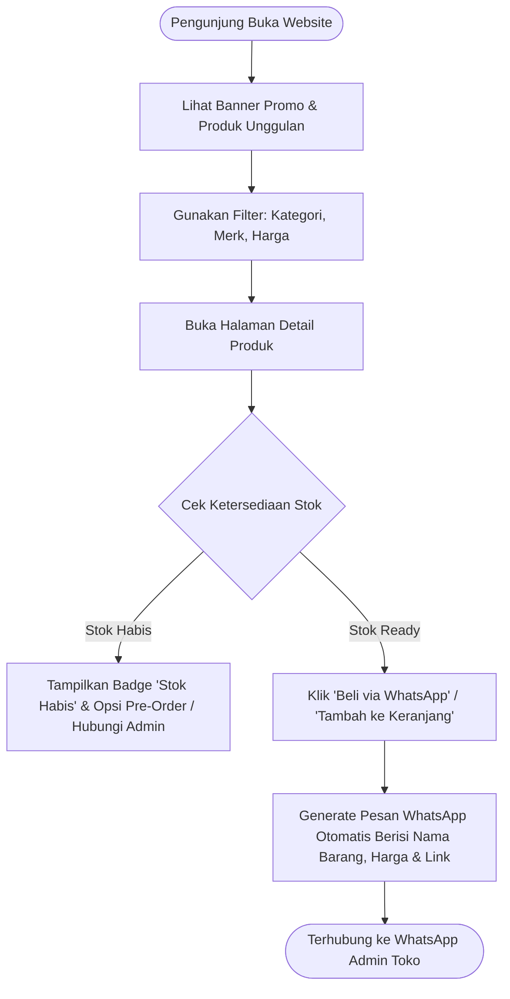

# Product Requirement Document (PRD): Katalog Publik & Storefront (Opsi 3)

**Nama Proyek:** Katalog Publik & Toko Online (Storefront / E-Commerce Module)  
**Aplikasi Induk:** Sistem Manajemen Inventaris Gudang Gadget  
**Status:** Draft / Proposed  
**Versi:** 1.0  
**Tanggal:** 27 September 2026  

---

## 1. Ringkasan Eksekutif (Executive Summary)

### 1.1 Latar Belakang
Aplikasi gudang saat ini dirancang untuk operasional internal dan kasir fisik (POS). Untuk menjangkau calon pembeli di luar toko fisik serta memberikan akses informasi katalog produk secara transparan 24/7, diperlukan **Halaman Katalog Publik & Storefront (Toko Online)** yang terhubung langsung ke inventaris stok gudang.

### 1.2 Tujuan & Sasaran (Objectives)
- **Brosur Digital 24/7:** Menyediakan etalase online modern bagi calon pembeli untuk melihat daftar produk, foto detail, spesifikasi, dan status ketersediaan barang.
- **Drive-to-Store & Fast Order WhatsApp:** Memudahkan pelanggan untuk memesan langsung melalui tombol WhatsApp otomatis (*Instant Chat Order*) atau datang langsung ke toko fisik.
- **Sinkronisasi Stok Real-Time:** Menampilkan status barang *Ready Stock* atau *Habis* secara akurat berdasarkan data di gudang tanpa perlu update manual dua kali.
- **Privasi Data Internal:** Memastikan data rahasia gudang (seperti harga beli/modal, data supplier, dan histori stok) tetap terlindungi dan hanya harga jual publik serta info produk yang ditampilkan ke pengunjung.

---

## 2. Pengguna & Persona (User Personas)

| Persona | Perilaku & Kebutuhan | Fitur Utama yang Digunakan |
| :--- | :--- | :--- |
| **Calon Pembeli / Pengunjung Web** | Mencari gadget tertentu, membandingkan harga/spesifikasi, mengecek apakah barang tersedia di toko. | - Beranda & Banner Promo<br>- Pencarian & Filter Produk (Kategori, Brand, Range Harga)<br>- Halaman Detail Produk & Galeri Foto<br>- Tombol Pesan via WhatsApp / Keranjang Belanja |
| **Admin Web / Marketing** | Mengelola tampilan depan toko, mengatur produk unggulan, dan membalas pesanan masuk. | - Pengaturan Banner & Headline Promo<br>- Toggle Tampilkan/Sembunyikan Produk di Web Publik<br>- Pengaturan Jam Buka Toko, Alamat & Nomor Kontak WhatsApp |

---

## 3. Alur Kerja Pengguna (User Journey)



---

## 4. Kebutuhan Fungsional (Functional Requirements)

### FR-1: Antarmuka Beranda Publik (Homepage & Storefront UI)
- **FR-1.1:** Tampilan desain modern, *clean*, estetik, dan *mobile-first* (responsif di smartphone & desktop).
- **FR-1.2:** **Hero Section:** Banner slider promosi / info promo potongan harga / trade-in gadget.
- **FR-1.3:** **Section Produk Unggulan (*Featured Gadgets*):** Menampilkan produk terbaru atau produk terlaris.
- **FR-1.4:** **Kategori Cepat:** Ikon pintasan kategori (misal: *Smartphone, Laptop, Tablet, Aksesoris, Audio*).
- **FR-1.5:** **Footer Informasi:** Alamat toko fisik (embed Google Maps), jam operasional, link media sosial, dan kontak customer service.

### FR-2: Katalog & Filter Pencarian Cerdas
- **FR-2.1:** Kolom pencarian instan berdasarkan nama produk, tipe, merk, atau kata kunci spesifikasi.
- **FR-2.2:** Filter Multi-Kriteria:
  - Berdasarkan Merk / Brand (Apple, Samsung, Xiaomi, Asus, dll.)
  - Berdasarkan Rentang Harga (Slider min - max harga)
  - Berdasarkan Kondisi (Baru / Segel vs Bekas / Second Mulus)
  - Berdasarkan Status Ketersediaan (Hanya tampilkan yang *Ready Stock*)
- **FR-2.3:** Pengurutan (*Sorting*): Harga Terendah, Harga Tertinggi, Produk Terbaru, dan Paling Populer.

### FR-3: Halaman Detail Produk (Product Details Page)
- **FR-3.1:** Galeri foto produk interaktif dengan fitur *zoom* / thumbnail preview.
- **FR-3.2:** Tampilan Badge Ketersediaan:
  - 🟢 **Ready Stock** (jika stok > 0)
  - 🔴 **Stok Habis** (jika stok = 0)
- **FR-3.3:** Rincian Spesifikasi Teknis (Tabel spesifikasi: Layar, Chipset, RAM/Storage, Kamera, Baterai, Kelengkapan Unit, Garansi Toko/Resmi).
- **FR-3.4:** Tab Deskripsi Produk & Catatan Kondisi (khusus gadget second: minus/kemulusan bodi).
- **FR-3.5:** Rekomendasi Produk Terkait (*Related Products*).

### FR-4: Integrasi Pemesanan Fleksibel (Order Channel)

#### Model A: Instant WhatsApp Checkout (Fase Awal - Cepat & Ringan)
- Tombol aksi utama: **"Tanya Stok / Pesan via WhatsApp"**.
- Saat diklik, sistem membuka link WhatsApp (`https://wa.me/...`) dengan pesan yang telah diformat otomatis:
  > *"Halo Admin [Nama Toko], saya tertarik membeli produk ini:*  
  > *• Produk: [Nama Gadget]*  
  > *• Varian/Kapasitas: [256GB / Warna Hitam]*  
  > *• Harga: Rp [Harga Jual]*  
  > *• Link: [URL Produk]*  
  > *Apakah unit ini masih tersedia?"*

#### Model B: Keranjang Belanja & Form Pengiriman (Fase Lanjutan)
- Pengunjung dapat mengumpulkan beberapa barang ke keranjang (*Shopping Cart*).
- Form input alamat pengiriman & pilihan kurir pengiriman (JNE, J&T, SiCepat, Grab/Gojek Instant).
- Integrasi Payment Gateway (Midtrans / Xendit) untuk pembayaran instan via QRIS, Virtual Account, atau Kartu Kredit.

### FR-5: Pengaturan Storefront di Dashboard Admin
- **FR-5.1:** Toggle visibilitas produk: Admin dapat mengatur apakah produk tertentu ditampilkan di katalog publik atau hanya ada di gudang internal.
- **FR-5.2:** Pengaturan Banner Slider (Upload gambar banner promo, judul, deskripsi, dan URL tujuan).
- **FR-5.3:** Pengaturan Profil Toko (Nama toko, nomor WhatsApp CS, jam operasional, alamat lengkap, dan logo).

---

## 5. Kebutuhan Non-Fungsional (Non-Functional Requirements)

| Aspek | Spesifikasi Kebutuhan |
| :--- | :--- |
| **Kecepatan Muat (Page Load Speed)** | < 1.5 detik pada koneksi 4G mobile. Optimalisasi gambar menggunakan format WebP dan lazy loading. |
| **Search Engine Optimization (SEO)** | Meta title, meta description dinamis per produk, Open Graph tags untuk preview gambar saat link dibagikan di WhatsApp/Facebook/Instagram. |
| **Keamanan & Isolasi Data** | Akses katalog publik adalah *read-only*. API endpoint publik dilarang mengekspos field sensitif (seperti `purchase_price`, `supplier_id`, `created_by`). |
| **Tampilan Responsif** | 100% responsif pada perangkat mobile (iOS & Android) dan desktop browser utama. |

---

## 6. Penyesuaian Skema Database (Database Extensions)

Untuk mendukung katalog publik tanpa merusak struktur inventaris gudang yang sudah ada, ditambahkan beberapa kolom pada tabel `gadgets` dan 2 tabel baru:

### 6.1 Tambahan Kolom pada Tabel `gadgets`
```sql
ALTER TABLE gadgets ADD COLUMN is_published BOOLEAN DEFAULT TRUE;
ALTER TABLE gadgets ADD COLUMN is_featured BOOLEAN DEFAULT FALSE;
ALTER TABLE gadgets ADD COLUMN condition VARCHAR(20) DEFAULT 'new'; -- 'new', 'like-new', 'used'
ALTER TABLE gadgets ADD COLUMN specifications JSON NULL;           -- detail RAM, Layar, Baterai, dll
ALTER TABLE gadgets ADD COLUMN warranty_info VARCHAR(255) NULL;    -- info garansi resmi / toko
```

### 6.2 Tabel Baru: `store_banners`
- `id` (PK, BigInt)
- `title` (String)
- `subtitle` (String, Nullable)
- `image_path` (String)
- `cta_link` (String, Nullable)
- `order_position` (Integer, Default: 0)
- `is_active` (Boolean, Default: true)
- `created_at`, `updated_at`

### 6.3 Tabel Baru: `store_settings`
- `id` (PK, BigInt)
- `key` (String, Unique - contoh: `store_name`, `whatsapp_number`, `store_address`, `instagram_url`)
- `value` (Text)
- `created_at`, `updated_at`

---

## 7. Rencana Tahapan Pelaksanaan (Phased Implementation Roadmap)

```
[ Fase 1: Katalog Publik Ringan (Katalog + WA Order) ]
├── Setup Layout Publik (Navbar Publik, Footer Info, Desain Tema)
├── Halaman Beranda (Hero Slider, Grid Produk Unggulan)
├── Halaman Katalog & Filter (Pencarian, Filter Kategori/Brand, Sort Harga)
├── Halaman Detail Produk + Generator Link WhatsApp Otomatis
└── Menu Admin: Pengaturan Banner & Toggle Produk Publik

[ Fase 2: Peningkatan SEO & Branding ]
├── Setup Dynamic Meta Tags & OpenGraph Share Preview
├── Integrasi Google Maps Toko & Jam Operasional
└── Optimasi Kompresi Gambar WebP & Caching

[ Fase 3 (Opsional Nanti): Full Checkout & Online Payment ]
├── Modul Keranjang Belanja (Online Cart Session)
├── Integrasi RajaOngkir (Cek Ongkos Kirim Otomatis)
└── Integrasi Midtrans / Xendit (Payment Gateway Otomatis)
```

---

## 8. Kriteria Keberhasilan (Definition of Done)
1. Pengunjung dapat membuka website tanpa login dan melihat daftar barang yang berstatus `is_published = true`.
2. Status ketersediaan barang (Stok Tersedia / Habis) selalu sinkron dengan data fisik di gudang.
3. Tombol **"Pesan via WhatsApp"** berhasil membuka WhatsApp dengan template teks yang memuat detail produk secara akurat.
4. Field harga beli / HPP dan data supplier **tidak pernah bocor** ke halaman publik atau response API publik.
5. Halaman web memiliki nilai performa dan mobile-friendliness yang baik saat diakses dari smartphone.
