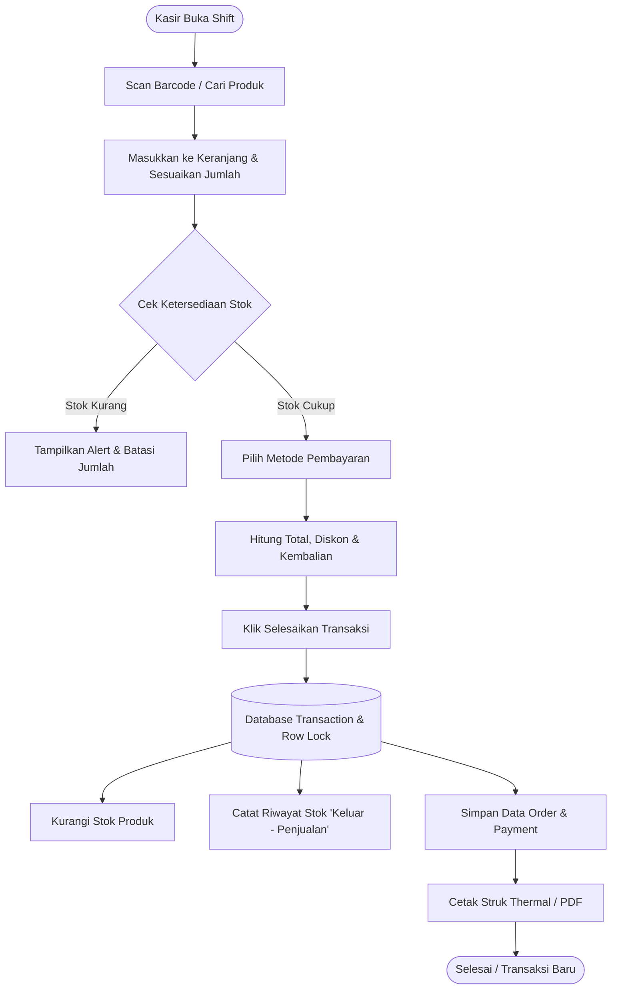

# Product Requirement Document (PRD): Modul Kasir / Point of Sale (POS)

**Nama Proyek:** Modul Kasir & Penjualan Toko (POS Module)  
**Aplikasi Induk:** Sistem Manajemen Inventaris Gudang Gadget  
**Status:** Draft / Proposed  
**Versi:** 1.0  
**Tanggal:** 27 September 2026  

---

## 1. Ringkasan Eksekutif (Executive Summary)

### 1.1 Latar Belakang
Saat ini, aplikasi gudang berfungsi untuk pencatatan stok produk/gadget secara internal. Untuk mendukung operasional toko fisik atau penjualan langsung, dibutuhkan **Modul Kasir / Point of Sale (POS)** yang terhubung langsung secara *real-time* dengan stok gudang tanpa perlu melakukan penyesuaian stok secara manual setelah barang terjual.

### 1.2 Tujuan & Sasaran (Objectives)
- **Otomasi Pemotongan Stok:** Setiap transaksi penjualan di kasir langsung memotong stok produk di gudang secara otomatis dan mencatat riwayat pergerakan stok (*stock log*).
- **Kecepatan Layanan Kasir:** Membantu kasir memproses antrean pembeli dengan antarmuka yang cepat, responsif, dan mendukung *barcode scanner* serta *keyboard shortcuts*.
- **Pencegahan Human Error & Race Condition:** Mencegah penjualan barang melebihi stok fisik yang tersedia (*overselling*) meskipun diakses oleh banyak kasir sekaligus.
- **Transparansi & Rekonsiliasi:** Menyediakan laporan penjualan harian, rekapitulasi kas masuk, dan bukti transaksi (cetak struk fisik/PDF).

---

## 2. Pengguna & Hak Akses (User Roles & Personas)

| Peran (Role) | Tanggung Jawab Utama | Hak Akses di Modul Kasir |
| :--- | :--- | :--- |
| **Kasir / Staf Toko** | Melayani pembeli, input pesanan, memproses pembayaran, mencetak struk. | - Akses halaman Kasir (POS)<br>- Mencari produk & menambah ke keranjang<br>- Input diskon standar / catatan transaksi<br>- Checkout transaksi & cetak struk<br>- Buka/tutup shift kasir & rekap harian |
| **Admin Toko / Kepala Gudang** | Mengawasi transaksi, audit stok, persetujuan pembatalan. | - Semua akses Kasir<br>- Otorisasi *Void* / Batalkan Transaksi<br>- Retur penjualan & pengembalian stok<br>- Akses laporan laba-rugi & performa penjualan |
| **Owner / Super Admin** | Pengambilan keputusan bisnis, konfigurasi sistem. | - Akses penuh seluruh laporan, setting metode pembayaran, konfigurasi pajak/diskon global, dan audit log. |

---

## 3. Alur Kerja Utama (Core Workflows)



---

## 4. Kebutuhan Fungsional (Functional Requirements)

### FR-1: Antarmuka Layar Kasir (POS UI & Fast Checkout)
- **FR-1.1:** Tampilan layar penuh (*clean & high-contrast*) yang terbagi atas:
  - **Panel Kiri/Tengah:** Katalog produk cepat (grid kategori/gambar) dan kolom pencarian (*live search* nama, tipe, IMEI/Serial, SKU/Barcode).
  - **Panel Kanan:** Keranjang belanja aktif (*Cart Panel*), ringkasan harga, tombol pembayaran.
- **FR-1.2:** Dukungan *Barcode / QR Scanner* (input langsung masuk ke keranjang saat discan).
- **FR-1.3:** *Keyboard Shortcuts* (contoh: `F2` untuk cari produk, `F8` untuk bayar, `ESC` untuk reset keranjang).
- **FR-1.4:** Fitur *Hold Cart* / Simpan Keranjang Sementara (untuk melayani antrean lain jika pembeli sedang mengambil barang tambahan).

### FR-2: Manajemen Keranjang & Pembayaran
- **FR-2.1:** Pengaturan kuantitas produk, catatan khusus per item (misal: IMEI tertentu, warna khusus, serial number).
- **FR-2.2:** Perhitungan otomatis: Subtotal, Diskon (Nominal / Persen), Pajak (PPN jika berlaku), dan Total Tagihan.
- **FR-2.3:** Dukungan Multi-Metode Pembayaran:
  - **Tunai (Cash):** Input nominal diterima dan kalkulasi uang kembalian otomatis.
  - **QRIS / Transfer Bank:** Upload referensi bukti bayar / status konfirmasi.
  - **Debit / Kartu Kredit / EDC:** Input nomor referensi transaksi mesin EDC.
  - **Split Payment:** Pembayaran sebagian tunai + sebagian transfer/debit.

### FR-3: Integritas Stok & Keamanan Transaksi Database
- **FR-3.1 (Atomic Transaction):** Pemrosesan checkout wajib dibungkus dalam `DB::transaction()` untuk menjamin jika ada kegagalan simpan struk/payment, stok tidak berkurang secara parsial.
- **FR-3.2 (Row Locking):** Menggunakan `lockForUpdate()` pada record produk saat checkout untuk mencegah *race condition* / bentrok data stok ketika ada beberapa kasir bertransaksi bersamaan.
- **FR-3.3 (Audit Log Stok):** Setiap transaksi kasir otomatis menambahkan record ke tabel `stock_histories` dengan keterangan: `Tipe: Keluar`, `Referensi: No Invoice`, `User: Nama Kasir`.

### FR-4: Cetak Struk & Bukti Transaksi
- **FR-4.1:** Format cetak struk untuk *Thermal Printer* (58mm dan 80mm).
- **FR-4.2:** Opsi unduh Struk Digital dalam format **PDF**.
- **FR-4.3:** Fitur kirim salinan struk via **WhatsApp Web Link** langsung ke nomor pembeli.
- **FR-4.4:** Informasi pada struk mencakup: Nama Toko, Alamat, No. Telp, No. Nota/Invoice, Tanggal & Jam, Nama Kasir, Rincian Barang (Qty x Harga), Total, Metode Bayar, Kembalian, dan Footer Pesan Garansi/Terima Kasih.

### FR-5: Laporan Penjualan & Tutup Kasir (Cash Closing)
- **FR-5.1:** Buka & Tutup Shift Kasir (Mencatat Modal Awal Kas dan Rekap Uang Akhir Kasir).
- **FR-5.2:** Laporan Ringkasan Harian:
  - Total omzet kotor & bersih
  - Jumlah transaksi sukses
  - Rincian penerimaan per metode bayar (Total Tunai, Total QRIS, Total Debit)
  - Daftar barang terlaris (*Top Selling Gadgets*)
- **FR-5.3:** Ekspor laporan penjualan ke format Excel/CSV & PDF.

### FR-6: Pembatalan Transaksi (Void) & Retur
- **FR-6.1 (Void):** Kasir tidak dapat menghapus transaksi yang sudah selesai tanpa otorisasi PIN / Password Admin.
- **FR-6.2 (Pengembalian Stok):** Transaksi yang di-void atau barang yang diretur otomatis mengembalikan stok ke gudang dengan log `Tipe: Masuk - Retur Penjualan`.

---

## 5. Kebutuhan Non-Fungsional (Non-Functional Requirements)

| Kategori | Spesifikasi Kebutuhan |
| :--- | :--- |
| **Kecepatan & Latensi** | Waktu pemrosesan checkout < 1 detik. Pencarian produk *instant* (< 200ms). |
| **Keandalan Data (ACID)** | Zero-tolerance terhadap ketidaksesuaian stok fisik vs data sistem. |
| **Kompatibilitas Hardware** | Mendukung USB/Bluetooth Thermal Receipt Printer (ESC/POS) dan Barcode Scanner standar (HID Mode). |
| **Tampilan / UX** | Antarmuka intuitif, tombol angka/aksi berukuran besar agar nyaman di layar sentuh (*touchscreen POS ready*). |
| **Keamanan** | Perlindungan CSRF, pembatasan otorisasi role, enkripsi session, dan log pencatatan audit. |

---

## 6. Desain Database & Skema Data (Draft Entity Relationship)

### 6.1 Tabel `sales_transactions` (Tabel Induk Penjualan)
- `id` (PK, BigInt / UUID)
- `invoice_number` (String, Unique - Contoh: `INV-20260927-0001`)
- `cashier_id` (FK to `users.id`)
- `customer_name` (String, Nullable)
- `customer_phone` (String, Nullable)
- `subtotal` (Decimal 15,2)
- `discount_amount` (Decimal 15,2, Default: 0)
- `tax_amount` (Decimal 15,2, Default: 0)
- `total_amount` (Decimal 15,2)
- `paid_amount` (Decimal 15,2)
- `change_amount` (Decimal 15,2)
- `payment_method` (Enum: `cash`, `qris`, `debit`, `transfer`, `split`)
- `payment_status` (Enum: `paid`, `void`, `refunded`)
- `notes` (Text, Nullable)
- `created_at`, `updated_at`

### 6.2 Tabel `sales_transaction_items` (Detail Produk Terjual)
- `id` (PK, BigInt)
- `sales_transaction_id` (FK to `sales_transactions.id`, Cascade On Delete)
- `gadget_id` (FK to `gadgets.id`)
- `product_name` (String - snapshot nama saat transaksi)
- `sku` (String, Nullable)
- `unit_cost` (Decimal 15,2 - HPP saat itu untuk hitung laba)
- `unit_price` (Decimal 15,2 - Harga jual)
- `quantity` (Integer)
- `discount_item` (Decimal 15,2, Default: 0)
- `subtotal` (Decimal 15,2)
- `notes` (String, Nullable - misal: No. IMEI/Serial)

### 6.3 Tabel `cashier_shifts` (Buka/Tutup Kasir)
- `id` (PK, BigInt)
- `user_id` (FK to `users.id`)
- `start_cash` (Decimal 15,2)
- `end_cash` (Decimal 15,2, Nullable)
- `actual_cash` (Decimal 15,2, Nullable - Uang fisik saat tutup kasir)
- `difference` (Decimal 15,2, Nullable - Selisih lebih/kurang)
- `opened_at` (Timestamp)
- `closed_at` (Timestamp, Nullable)
- `notes` (Text, Nullable)

---

## 7. Rencana Tahapan Implementasi (Implementation Roadmap)

```
[ Fase 1: Fondasi Backend & Database ]
├── Buat migrasi tabel sales_transactions, sales_transaction_items, cashier_shifts
├── Buat Model & Relasi Eloquent
└── Service Layer: Transaksi Penjualan aman (DB Transaction + lockForUpdate + audit stok)

[ Fase 2: Antarmuka Layar Kasir (POS Front-End) ]
├── Desain UI Layar Kasir (Katalog Produk + Keranjang Belanja Interaktif)
├── Integrasi Pencarian Cepat & Barcode Input
└── Form Modal Pembayaran (Cash, QRIS, Kembalian Dinamis)

[ Fase 3: Struk & Manajemen Output ]
├── Template Cetak Struk Thermal (ESC/POS & Print CSS 58mm/80mm)
├── Download Struk PDF & Share link WA
└── Halaman Riwayat Transaksi & Filter Tanggal/Kasir

[ Fase 4: Shift Kasir, Void & Laporan ]
├── Fitur Buka/Tutup Shift Kasir (Rekap Kas Masuk)
├── Fitur Void / Retur dengan Otorisasi Admin
└── Dashboard Laporan Penjualan (Harian/Bulanan/Top Product)
```

---

## 8. Kriteria Keberhasilan (Definition of Done)
1. Transaksi penjualan kasir berhasil mengurangi jumlah stok barang di database secara tepat dan instan.
2. Tidak terjadi error atau stok minus saat dua kasir checkout barang yang sama dengan sisa stok 1.
3. Struk dapat dicetak dengan format rapi pada printer thermal.
4. Laporan harian menampilkan total penjualan dan rincian kas masuk secara akurat.
5. Hak akses kasir terisolasi dengan aman dari menu setting/manajemen user level admin.
